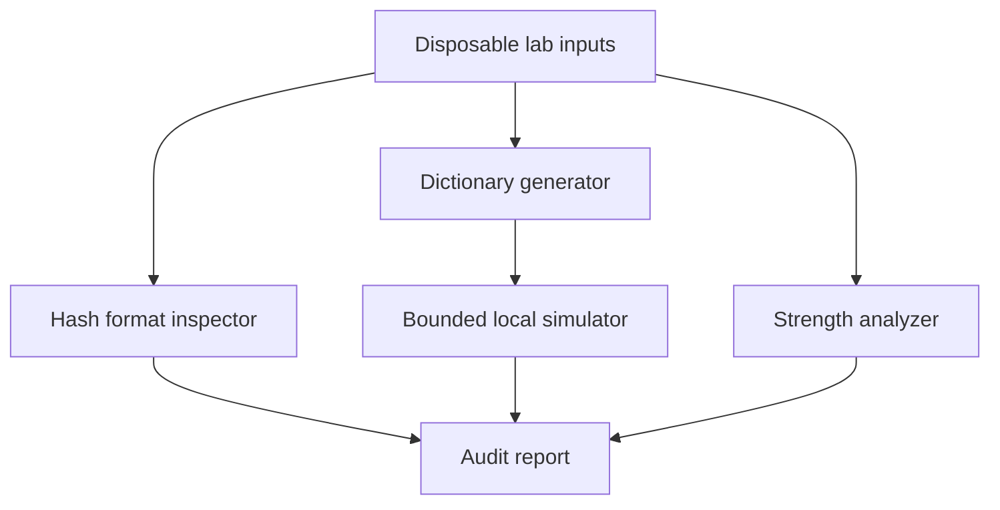

# Architecture and flowchart

The CLI dispatches to pure functions in `suite/core.py`. The report command accepts a local CSV with `label,password` columns and writes redacted JSON. No network API or host credential store is accessed.

## Data movement

1. User supplies disposable examples.
2. Dictionary generation creates a short, bounded candidate list in memory.
3. The inspector classifies synthetic hash strings. A 32-character hex string cannot reliably distinguish MD5 from an NT hash.
4. The simulator compares local lab candidates with a local teaching digest and stops at its limit.
5. The analyzer flags common and patterned passwords.
6. The report records findings and mitigation advice without plaintext.
